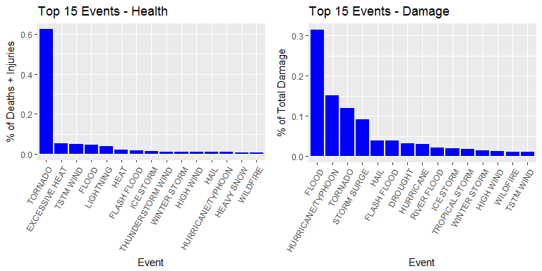
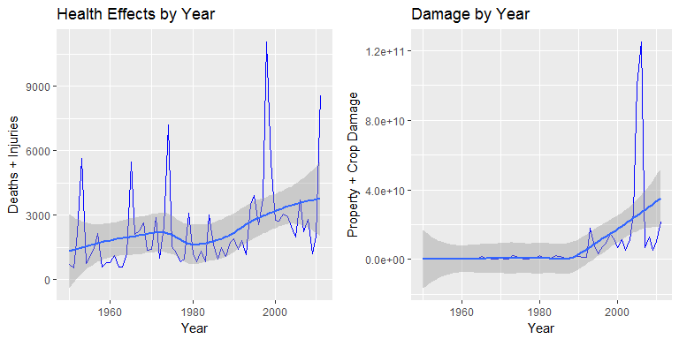

# Financial and Health Effects of Weather Events
Charlie LeCrone  
October 12, 2017  


## Synopsis

This analysis will evaluate the health and financial effects of various weather events.  The data comes from the U.S. National Oceanic and Atmospheric Administration's (NOAA) storm database.  I will be evaluating different weather events in terms of their effects on public health and financial impact.  Effects on public health will be defined as fatalities plus injuries, and the financial impact will be defined as property plus crop damage.  I will show the top 15 events in each category, and that for each, they represent over 90% of the total impact reflected in the data.  I'll also show how the events have trended over time.

### Load Libraries and Functions

First I will load the libraries and functions I will use in the analysis.  If a required library is not installed, I will install it.


```r
# load libraries

if("dplyr" %in% rownames(installed.packages()) == FALSE) {install.packages("dplyr")}
if("ggplot2" %in% rownames(installed.packages()) == FALSE) {install.packages("ggplot2")}
if("lubridate" %in% rownames(installed.packages()) == FALSE) {install.packages("lubridate")}
if("scales" %in% rownames(installed.packages()) == FALSE) {install.packages("scales")}

library(dplyr)
```

```
## 
## Attaching package: 'dplyr'
```

```
## The following objects are masked from 'package:stats':
## 
##     filter, lag
```

```
## The following objects are masked from 'package:base':
## 
##     intersect, setdiff, setequal, union
```

```r
library(ggplot2)
library(lubridate)
```

```
## 
## Attaching package: 'lubridate'
```

```
## The following object is masked from 'package:base':
## 
##     date
```

```r
library(scales)


# Multiple plot function
#
# ggplot objects can be passed in ..., or to plotlist (as a list of ggplot objects)
# - cols:   Number of columns in layout
# - layout: A matrix specifying the layout. If present, 'cols' is ignored.
#
# If the layout is something like matrix(c(1,2,3,3), nrow=2, byrow=TRUE),
# then plot 1 will go in the upper left, 2 will go in the upper right, and
# 3 will go all the way across the bottom.
#
multiplot <- function(..., plotlist=NULL, file, cols=1, layout=NULL) {
  library(grid)
  
  # Make a list from the ... arguments and plotlist
  plots <- c(list(...), plotlist)
  
  numPlots = length(plots)
  
  # If layout is NULL, then use 'cols' to determine layout
  if (is.null(layout)) {
    # Make the panel
    # ncol: Number of columns of plots
    # nrow: Number of rows needed, calculated from # of cols
    layout <- matrix(seq(1, cols * ceiling(numPlots/cols)),
                     ncol = cols, nrow = ceiling(numPlots/cols))
  }
  
  if (numPlots==1) {
    print(plots[[1]])
    
  } else {
    # Set up the page
    grid.newpage()
    pushViewport(viewport(layout = grid.layout(nrow(layout), ncol(layout))))
    
    # Make each plot, in the correct location
    for (i in 1:numPlots) {
      # Get the i,j matrix positions of the regions that contain this subplot
      matchidx <- as.data.frame(which(layout == i, arr.ind = TRUE))
      
      print(plots[[i]], vp = viewport(layout.pos.row = matchidx$row,
                                      layout.pos.col = matchidx$col))
    }
  }
}
```

## Data Processing

### Loading Data

Data comes from the U.S. National Oceanic and Atmospheric Administration's (NOAA) storm database. More information on the data can be found [here](https://d396qusza40orc.cloudfront.net/repdata%2Fpeer2_doc%2Fpd01016005curr.pdf).  I will check to see if the data exists first.  If not, I will download and read into the dataframe d1, then drop any columns not related to the analysis.


```r
# Check to see if data exists in working directory and download it if it is not

if(!file.exists("./repdata%2Fdata%2FStormData.csv.bz2"))
  
{
  fileURL<-"https://d396qusza40orc.cloudfront.net/repdata%2Fdata%2FStormData.csv.bz2"
  download.file(fileURL, destfile = "./repdata%2Fdata%2FStormData.csv.bz2")
}

# Read data file into data file d1

d1<-read.csv(bzfile("./repdata%2Fdata%2FStormData.csv.bz2"))

# Create a vector of the columns I want to keep

keep<-c(2,7,8,23,24,25,26,27,28)

d2<-d1[,keep]

# Show columns I've kept

names(d2)
```

```
## [1] "BGN_DATE"   "STATE"      "EVTYPE"     "FATALITIES" "INJURIES"  
## [6] "PROPDMG"    "PROPDMGEXP" "CROPDMG"    "CROPDMGEXP"
```

### Formatting Data 1

Next, I will check to see if there are any missing values.  After that, I'll convert the date column to a year and re-name the columns so they make more sense.


```r
# check for missing data

length(complete.cases(d2))-nrow(d2)
```

```
## [1] 0
```

```r
# trim off excess characters on dates

# convert from factor to character

d2$BGN_DATE<-as.character(d2$BGN_DATE)

# look at what dates look like

head(d2$BGN_DATE)
```

```
## [1] "4/18/1950 0:00:00"  "4/18/1950 0:00:00"  "2/20/1951 0:00:00" 
## [4] "6/8/1951 0:00:00"   "11/15/1951 0:00:00" "11/15/1951 0:00:00"
```

```r
# trim last 8 spaces

d2$BGN_DATE<-substr(d2$BGN_DATE, 1, nchar(d2$BGN_DATE)-8)

# convert to dates

d2$BGN_DATE<-as.Date(d2$BGN_DATE, "%m/%d/%Y")

# convert date to year

d2$BGN_DATE<-year(d2$BGN_DATE)

# Update Names

names(d2)<-c("Year", "State", "Event", "Deaths", "Injuries", "PropertyDamage", "PExp", "CropDamage", "CExp")

head(d2)
```

```
##   Year State   Event Deaths Injuries PropertyDamage PExp CropDamage CExp
## 1 1950    AL TORNADO      0       15           25.0    K          0     
## 2 1950    AL TORNADO      0        0            2.5    K          0     
## 3 1951    AL TORNADO      0        2           25.0    K          0     
## 4 1951    AL TORNADO      0        2            2.5    K          0     
## 5 1951    AL TORNADO      0        2            2.5    K          0     
## 6 1951    AL TORNADO      0        6            2.5    K          0
```

### Formatting Data 2

Data for property and crop data include a number and an exponential multiplier.  The code below will examine the different multipliers in the data, and calculate the correct damage estimate for each row.


```r
# Look at levels of propergy damage multiplier

Plvllist<-levels(d2$PExp)
Clvllist<-levels(d2$CExp)

Plvllist
```

```
##  [1] ""  "-" "?" "+" "0" "1" "2" "3" "4" "5" "6" "7" "8" "B" "h" "H" "K"
## [18] "m" "M"
```

```r
Clvllist
```

```
## [1] ""  "?" "0" "2" "B" "k" "K" "m" "M"
```

```r
#Convert Exponent columns to character

d2$PExp<-as.character(d2$PExp)
d2$CExp<-as.character(d2$CExp)

# Convert exponent flags to numeric characters

d2<-d2 %>% 
  mutate(PExp = ifelse(PExp == "H" | PExp == "h", "2", PExp)) %>%
  mutate(PExp = ifelse(PExp == "K" | PExp == "k", "3", PExp)) %>%
  mutate(PExp = ifelse(PExp == "M" | PExp == "m", "6", PExp)) %>%
  mutate(PExp = ifelse(PExp == "B" | PExp == "b", "9", PExp)) %>%
  mutate(PExp = ifelse(PExp == "+", "0", PExp))               %>%
  mutate(CExp = ifelse(CExp == "H" | CExp == "h", "2", CExp)) %>%
  mutate(CExp = ifelse(CExp == "K" | CExp == "k", "3", CExp)) %>%
  mutate(CExp = ifelse(CExp == "M" | CExp == "m", "6", CExp)) %>%
  mutate(CExp = ifelse(CExp == "B" | CExp == "b", "9", CExp)) %>%
  mutate(CExp = ifelse(CExp == "+", "0", CExp))

# Convert numeric flags to actual numbers - creates NAs for non numerics

d2$PExp<-as.numeric(d2$PExp)
```

```
## Warning: NAs introduced by coercion
```

```r
d2$CExp<-as.numeric(d2$CExp)
```

```
## Warning: NAs introduced by coercion
```

```r
# Convert NAs to -1

d2 <- d2 %>%
  mutate(PExp = ifelse(is.na(PExp),-1,PExp)) %>%
  mutate(CExp = ifelse(is.na(CExp),-1,CExp))


# Convert Property Damage and Crop Damage estimates by multiplying by the exponents

d2<- d2 %>%
  mutate(PropertyDamage = ifelse(PExp == -1, 0, PropertyDamage*10^PExp)) %>%
  mutate(CropDamage = ifelse(CExp == -1, 0, CropDamage*10^CExp))
```

### Formatting Data 3

Now I will prepare to data frames for plotting.  One will have the top 15 weather events in terms of Total Health effects, the other will have the top 15 weather events in terms of Total Damage.  I will check to confirm that the top 15 events in each category represent over 90% of the total impact described in the data set.  There are 985 different weather events described in the data.  I want to ensure we're looking at the majority of damage and health effects.


```r
# Group by Events and total damage and health statistics

d3<-d2 %>%
  group_by(Event) %>%
  summarize(PropertyDamage=sum(PropertyDamage), CropDamage = sum (CropDamage), Deaths=sum(Deaths), Injuries=sum(Injuries))

# Add Deaths + Injuries and Crop + Property Damage

d3$TotalHealth<-with(d3, Deaths+Injuries)
d3$TotalDamage<-with(d3, PropertyDamage+CropDamage)

# Select only the columns I need for plots

keep3<-c(1,6,7)

d3<-d3[,keep3]

# Arrange on table by Health Impact and another by Damage

p1<-arrange(d3, desc(TotalHealth))

p2<-arrange(d3, desc(TotalDamage))

# Select the top 15 Health Impact Events and the top 10 Damage Events

p1<-p1[1:15,]

p2<-p2[1:15,]

# Check to see what percentage of totals are represented by the top 15

TH<-sum(d3$TotalHealth)
TD<-sum(d3$TotalDamage)
PH<-sum(p1$TotalHealth)
PD<-sum(p2$TotalDamage)

PH/TH # Percent of total health impact from top 10
```

```
## [1] 0.9212323
```

```r
PD/TD # Percent of total damage from top 10
```

```
## [1] 0.9213238
```

```r
# Add percentage column to p1 and p2

p1$percent<-p1$TotalHealth/TH

p2$percent<-p2$TotalDamage/TD

# look at plotting data frames

head(p1)
```

```
## # A tibble: 6 x 4
##            Event TotalHealth  TotalDamage    percent
##           <fctr>       <dbl>        <dbl>      <dbl>
## 1        TORNADO       96979  57362333944 0.62296609
## 2 EXCESSIVE HEAT        8428    500155700 0.05413912
## 3      TSTM WIND        7461   5038935845 0.04792739
## 4          FLOOD        7259 150319678250 0.04662979
## 5      LIGHTNING        6046    942471517 0.03883782
## 6           HEAT        3037    403258500 0.01950884
```

```r
head(p2)
```

```
## # A tibble: 6 x 4
##               Event TotalHealth  TotalDamage    percent
##              <fctr>       <dbl>        <dbl>      <dbl>
## 1             FLOOD        7259 150319678250 0.31491835
## 2 HURRICANE/TYPHOON        1339  71913712800 0.15065857
## 3           TORNADO       96979  57362333944 0.12017356
## 4       STORM SURGE          51  43323541000 0.09076242
## 5              HAIL        1376  18761221926 0.03930459
## 6       FLASH FLOOD        2755  18243990872 0.03822099
```

## Results

### Figure 1 - Top Sources of Financial and Public Health Impact

The plots show that tornadoes pose the biggest threat to public health and that floods cause the most damage.


```r
# Create plots of top 15s for Health and Damage Impact

plot1<-ggplot(aes(x=Event, y=percent),data=p1)+geom_bar(fill="blue", stat="identity")+
  labs(x="Event", y="% of Deaths + Injuries", title="Top 15 Events - Health")+
  theme(legend.position = "none", axis.text.x = element_text(angle = 60,hjust = 1))+
  scale_x_discrete(limits=p1$Event)

plot2<-ggplot(aes(x=Event, y=percent),data=p2)+geom_bar(fill="blue", stat="identity")+
  labs(x="Event", y="% of Total Damage", title="Top 15 Events - Damage")+
  theme(legend.position = "none", axis.text.x = element_text(angle = 60,hjust = 1))+
  scale_x_discrete(limits=p2$Event)

multiplot(plot1, plot2, cols=2)
```

<!-- -->


### Figure 2 - Health and Financial Impacts over Time

Finally, we'll look at how these weather effects have trended over time.  The documentation with the data says that the data are thin in the early years, but these plots show that the public health impacts and total damage from weather events have been increasing over the last 30 years.


```r
# Create a vector of uniqe Events from both top 15 lists

keepnames<-unique(c(as.character(p1$Event), as.character(p2$Event)))

# Create a new data table for time series plot of impactful events

year<-d2

year$Event<-as.character(year$Event)

year<-subset(year, year$Event %in% keepnames)

yearplot<-year %>%
  group_by(Year) %>%
  summarize(HealthEffects=sum(Deaths+Injuries), FinancialEffects=sum(PropertyDamage+CropDamage)) %>%
  arrange(Year)

plot3<-ggplot(yearplot, aes(x=Year, y=HealthEffects))+geom_line(col="blue")+
  labs(x="Year", y="Deaths + Injuries", title="Health Effects by Year")+
  geom_smooth(method = "auto")

plot4<-ggplot(yearplot, aes(x=Year, y=FinancialEffects))+geom_line(col="blue")+
  labs(x="Year", y="Property + Crop Damage", title="Damage by Year")+
  geom_smooth(method = "auto")

multiplot(plot3, plot4, cols=2)
```

```
## `geom_smooth()` using method = 'loess'
## `geom_smooth()` using method = 'loess'
```

<!-- -->

